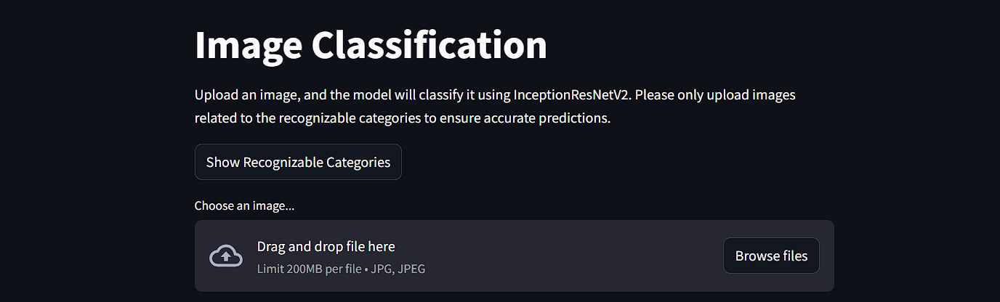
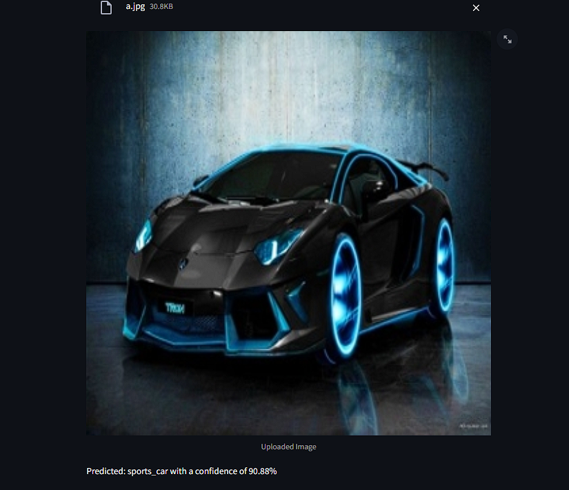

# AI-12-Object_Recognition_Classification_App
# Image Classification using Transfer Learning



This project demonstrates image classification using Transfer Learning with the **InceptionResNetV2** model. The model is pre-trained on the ImageNet dataset and can classify images into one of 1,000 categories. The application is built using **Streamlit**, allowing users to upload images and get predictions along with confidence scores.

## Project Overview

- **Model**: InceptionResNetV2 (pre-trained on ImageNet)
- **Framework**: TensorFlow Keras
- **Frontend**: Streamlit for a simple, interactive web interface
- **Input Size**: 299x299 pixels (required by InceptionResNetV2)
- **Categories**: This project includes a demo list of recognizable categories such as submarines, animals, vehicles, etc.

## How Transfer Learning Works

Transfer learning allows us to use pre-trained models on different datasets, reducing training time and achieving high accuracy. In this project, the InceptionResNetV2 model is used to classify user-uploaded images based on its knowledge from the ImageNet dataset.

### Key Features

- Upload an image through the web interface.
- Classify the image into one of 1,000 categories using the model.
- Display the predicted class and confidence score.

## Installation

1. Clone the repository:
```bash
https://github.com/Semssolak/AI-12-Object_Recognition_Classification_App.git
```

2. Run the Streamlit app:

```bash
streamlit run main.py
```

## Usage

1. Upload an image through the "Choose an image..." option.
2. The model will process the image and display the predicted class and confidence score.




## Recognizable Categories (Demo)

This is a shortened list of recognizable categories from the ImageNet dataset:
Tench, Goldfish, White Shark, Tiger Shark, Hammerhead, Electric Ray, Stingray, Cock, Hen, Ostrich, Pelican, Penguin, Parrot, Goose, Bald Eagle, Koala, Chimpanzee, Orangutan, Tiger, Lion, Leopard, Elephant, Zebra, Camel, Kangaroo, Submarine, Fire Engine, Taxi, Race Car, Bicycle, Motorcycle, Sports Car, Airplane, Warplane, Helicopter.

